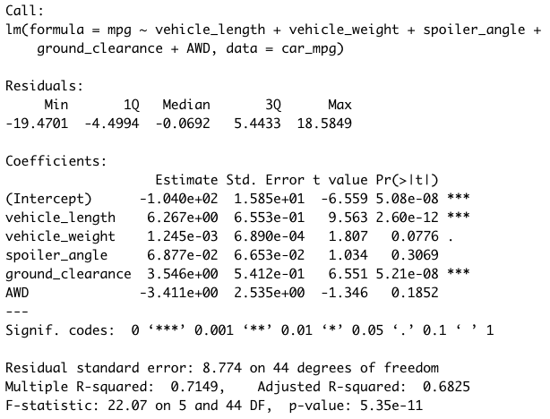

# Vehicle Production Statistical Analysis

## Overview
The purpose of this project was to perform statistical analysis on data related to the production of MechaCar prototypes in order to provide insights to the manufacturing team. 

All statistical analysis was performed in R using a [mileage per gallon (MPG) dataset](Resources/MechaCar_mpg.csv) and a [suspension coil dataset](Resources/Suspension_Coil.csv). The R Script for the analysis can be found [here](CarAnalysisScript.R).

## Linear Regression to Predict MPG
Multiple linear regression analysis was performed to identify which variables in the MPG dataset predict the MPG of the MechaCar prototypes. The independent variables included in the analysis were vehicle length, vehicle weight, spoiler angle, ground clearance, and all-wheel drive (AWD). As shown in the screenshot below, based on a statistical significance level of 0.05, vehicle length (p-value = 2.6 x 10 ^ -12) and ground clearance (p-value = 5.2 x 10 ^ -8) provide a non-random amount of variance to the MPG values in the dataset, while vehicle weight (p-value = 0.078), spoiler angle (p-value = 0.31), and AWD (p-value = 0.19) do not. The r-squared value of the multiple linear regression model is 0.71, which means that the model explains 71% of the variability in MPG. The p-value for the model is 5.4 x 10 ^ -11, again much smaller than our statistical significance level of 0.05, which allows us to reject the null hypothesis that the slope of our model is zero. Although the r-squared value of the multiple linear regression model indicates that it performs well in explaining the variability in MPG for the existing dataset, the fact that three out of five independent variables are not statistically significant is evidence of overfitting and the model may not predict future MPG data effectively.  Additionally, the intercept of the multiple regression model is statistically significant, which could mean that the statistically significant variables (vehicle length and ground clearance) need scaling/transforming to improve the model or that other variables not available in the dataset explain some of the variability in MPG. Ultimately, additional testing of the model with modifications to the independent variables seems warranted.

## Summary Statistics on Suspension Coils
Mean, median, variance, and standard deviation for the weight capacity of suspension coils produced at three different manufacturing lots were calculated. Weight capacity was measured in pounds per square inch (PSI). The statistics for all three lots combined are shown in the first screenshot below. We see that across all three lots, the variance of the suspension coils was 62 PSI, meeting the requirement that it not exceed 100 PSI. However, when we review the statistics by individual lot, as shown in the second screenshot below, we see that while the variance for lots 1 and 2 were far below 100 PSI (0.98 PSI and 7.5 PSI, respectively), the variance for lot 3 exceeded the maximum variance at 170 PSI. These data show that lot 3 was not satisfying the design specifications with respect to consistent suspension coil manufacturing standards.

**Summary Statistics for All Manufacturing Lots Combined**

**Summary Statistics for Individual Manufacturing Lots**

## T-Tests on Suspension Coils
T-tests were performed to determine if the weight capacity (PSI) of the suspension coils produced by all three manufacturing lots combined and by each lot individually was statistically significantly different than the population mean of 1500 PSI. 

As shown in the screenshot below of the t-test results for all three manufacturing lots combined, the mean weight capacity of the suspension coils produced was 1498.8 PSI, which was not statistically significantly different from the population mean of 1500 PSI based on a statistical significance level of 0.05 (p-value = 0.060).  

As shown in the screenshot below of the t-test for lot 1 only, the mean weight capacity of the suspension coils produced was equal to the population mean of 1500 PSI and the p-value was 1, indicating no statistical difference.

As shown in the screenshot below of the t-test for lot 2 only, the mean weight capacity of the suspension coils produced was 1500.2 PSI, which was not statistically significantly different from the population mean of 1500 PSI based on a statistical significance level of 0.05 (p-value = 0.61).

As shown in the screenshot below of the t-test for lot 3 only, the mean weight capacity of suspension coils produced by this lot (1496.1 PSI) was statistically significantly different from the population mean of 1500 PSI based on a statistical significance level of 0.05 (p-value = 0.042). Aligning with what we observed from the summary statistics for lot 3 above, production of suspension coils by this manufacturing lot appears to differ from the other two lots and not be consistent with manufacturing standards.

## Study Design: Our Prototype vs. the Competition
Given the recent dramatic increase in gas prices, many prospective car buyers are especially concerned with fuel efficiency when choosing a new vehicle. Therefore, in designing a statistical study to compare the MechaCar prototypes to other vehicles on the market, I would focus on city and highway fuel efficiency (MPG). I would limit the study to vehicles in the same class. In order to conduct the study, I would need city and highway MPG data for the MechaCar prototypes as well as for other vehicles in the same class. I would then perform a series of two-sample t-tests to:
-    Compare the mean fuel efficiency of the sample of MechaCar prototypes with the mean fuel efficiency of the sample of all other vehicles in the class; and
-    Compare the mean fuel efficiency of the sample of MechaCar prototypes with the mean fuel efficiency of the sample of each other individual manufacturer’s vehicles in the class.

I would perform this analysis separately looking at city MPG and highway MPG. Since I specifically want to focus on whether MechaCar vehicles are better than other vehicles on the market with respect to fuel efficiency, I would use a one-sided t-test. The null hypothesis for each of these t-tests would be that the mean fuel efficiency of the sample of MechaCar prototypes is less than or equal to the mean fuel efficiency of the sample of other vehicles. The alternative hypothesis for each t-test would be that the mean fuel efficiency of the sample of MechaCar prototypes is greater than the mean fuel efficiency of the sample of other vehicles. Note that I would not use ANOVA as the statistical test for the analysis because I am interested specifically in how MechaCar compares with other manufacturers’ vehicles, not just whether there are statistically significant differences in fuel efficiency amongst various manufacturers’ vehicles.  Finally, in addition to performing the statistical analysis, I would create separate city and highway boxplots to visualize the comparison of fuel efficiency amongst the different car manufacturers. 
